# Rapport mini-projet

Étudiants : Lucas Charbonnier, Cristhian Ronquillo, Vicky Butty

## Sujet choisi

**Projet 5: Génomes Mitochondriaux**

- Comparer, pour les espèces *S. pombe* et *S. cerevisiae*, les caractéristiques de leurs génomes mitochondriaux (mtDNA)
- Extraire les gènes codants et leurs annotations
- Extraire et visualiser des statistiques comme la taille, composition en bases, nombre de gènes codants, etc
- Identifier les voies métaboliques impliquées dans la digestion du glucose en aérobie (respiration) ou anaérobie (fermentation) et placer les gènes mitochondriaux dans ce contexte
- Présenter les résultats

## Contexte

Les levures à analyser, *S. pombe* et *S. cerevisiae*, aussi connues sous les noms respectifs de "levure de fission" et "levure de boulangerie", sont deux organismes très documentés et souvent examinés en laboratoire pour comprendre le fonctionnement du vivant.

L'être humain a démontré à de nombreuses reprises son obsession pour la pratique consistant à "laisser traîner accidentellement" des préparations dans des récipients fermés, ce qui a conduit à la création de nombreux produits : 
- Le pain : Les levures consomment le sucre contenu dans la pâte et produisent du Co2, ce qui permet de faire lever la pâte et donner au pain une texture aérée, au lieu d'une simple galette.
- Le fromage : Les levures jouent un rôle clé durant l'affinage de certains fromages.
- Les boissons alcoolisées : Les levures sont à la base de nombreuses boissons alcoolisées, car elles produisent de l'alcool suite à la consommation du sucre (glucose). 
- Le kéfir : C'est une boisson à base d'eau (ou de lait) faite à partir de grain de kéfir (combinaison de levures et bactéries lactiques).
- Le kimchi : Élément important de la cuisine coréenne, la préparation du kimchi consiste à laisser fermenter du chou chinois dans de la saumure pendant plusieurs semaines. 
- La kombucha : La kombucha est préparée à partir d'une culture de levures et bactéries plongées dans un mélange sucré (généralement du thé noir).

Mis à part les préparations culinaires, les levures sont également utilisées dans la création de produits pharmaceutiques. Le principe repose sur la modification du génome d'une levure pour qu'elle synthétise une molécule spécifique. Par exemple, des biologistes ont réussi à faire en sorte que des levures synthétisent de la psilocybine, molécule utilisée pour soigner certaines dépressions lourdes. Une molécule qui serait généralement assez compliquée à obtenir car elle nécessiterait de faire pousser des champignons pour en extraire le principe actif. C'est donc un gain de temps impressionnant.

## Données

Pour ce projet, l’analyse se concentre donc sur les génomes mitochondriaux des deux espèces de levures, *Schizosaccharomyces pombe* et *Saccharomyces cerevisiae*. Contrairement au génome nucléaire, le génome mitochondrial est un ADN circulaire de plus petite taille, localisé dans les mitochondries, et spécialisé dans le fonctionnement de la respiration cellulaire. Bien que réduit en comparaison du génome principal, il conserve des gènes essentiels au métabolisme énergétique, notamment ceux codant pour des protéines de la chaîne respiratoire, des ARN de transfert (ARNt), et des ARN ribosomiques (ARNr).

Les séquences complètes des génomes mitochondriaux ont été récupérées depuis la base de données GenBank / RefSeq du NCBI. Les identifiants d’accession utilisés sont les suivants :

- *S. cerevisiae* : [NC_027264](https://www.ncbi.nlm.nih.gov/nuccore/NC_027264.1)
- *S. pombe* : [NC_088682](https://www.ncbi.nlm.nih.gov/nuccore/NC_088682.1/)

Bien que les séquences soient complètes, elles sont marquées comme "provisional RefSeq" (en date du 09.06.2025), ce qui signifie qu'elles n'ont pas encore été relues et validées manuellement par les experts du NCBI. Cela n'affecte pas la qualité de la séquence elle-même, qui est généralement fiable et issue d’une soumission contrôlée, mais cela peut avoir un impact sur l'exactitude ou l'exhaustivité des annotations (comme la position exacte des gènes, la présence d'introns ou de séquences non codantes).

Ces données vont permettre une série d'analyses statistiques, après extraction des gènes codants et de leurs annotations, ainsi que poser des bases pour des analyses de protéines et métaboliques.

## Analyse statistique descriptive

L’analyse statistique qui suit s’appuie sur les séquences mitochondriales présentées ci-dessus et sert à comparer les deux espèces de levures pour identifier de potentielles variations structurelles ou fonctionnelles. Calculées dans un notebook Jupyter, ces statistiques ont permis de relever des différences notables en termes de taille et de composition entre les génomes mitochondriaux étudiés.

En effet, le génome mitochondrial de *S. cerevisiae* possède 78'917 paires de bases, contre seulement 19'433 pour *S. pombe*, soit une variation de taille d'un facteur quatre. Cette différence ne s'explique pas uniquement pas le nombre de gènes présents dans ces séquences, comme cela sera montré plus loin, mais également par des variations dans le contenu non codant et la présence d'introns.

La composition en bases diffère aussi fortement : le génome mitochondrial de *S. cerevisiae* est très appauvri en GC avec seulement 16,13 %, tandis que *S. pombe* atteint 30,07 %. Cette statistique est intéressante, car la composition en bases peut influencer plusieurs aspects du fonctionnement mitochondrial, dont l’efficacité de la transcription et de la traduction. Un taux de GC plus élevé est également associé à une meilleure stabilité thermique de l'ADN et des ARNt. Ces différences reflètent des stratégies évolutives divergentes dans l’adaptation métabolique au niveau mitochondrial, malgré le fait que les deux espèces soient des levures.

Cette différence de taille et de composition pousse à s'intéresser sur la proportion du génome réellement consacrée aux gènes codants, pour mieux comprendre les stratégies d’optimisation ou de redondance mises en place dans le génome mitochondrial de chaque levure. Pour pouvoir évaluer cette répartition génétique, le nombre de gènes a été calculé. *S. pombe* présente 25 gènes d’ARNt, 2 d’ARNr, 1 autre ARNnm et 11 séquences codantes pour des protéines (CDS), soit un total de 39 gènes. De son côté, *S. cerevisiae* en contient respectivement 24, 2, 1 et 8, totalisant 35 gènes. À noter que les ARNnm (ARN non-messager) sont des ARN non codants, comme les ARNt et ARNr, mais les séquences utilisées n'offrent pas d'indication supplémentaire sur le type de ces ARN. La majorité des gènes sont localisés sur le brin positif chez les deux espèces, avec une exception chez *S. cerevisiae*, où un gène est situé sur le brin négatif. Ces chiffres bruts ne permettent pas de dire si l'une des levures possède une organisation du génome plus efficace, ne connaissant pas à ce stade les tailles des différents gènes. Il est donc plus pertinent de s’intéresser à la densité génétique, c’est-à-dire à la proportion du génome effectivement utilisée pour coder des gènes. Cette densité atteint 112,76 % chez *S. pombe* contre seulement 33,83 % pour *S. cerevisiae*. Le taux supérieur à 100% chez *S. pombe* est dû à un chevauchement de certaines séquences, par exemple avec des introns, et met en évidence une structuration bien plus compacte de son génome mitochondrial, en contraste avec la proportion importante de régions non codantes chez *S. cerevisiae*, indiquant un rôle possible des régions non codantes.

La différence de densité génétique entre nos deux levures et la présence de chevauchements chez *S. pombe* poussent à représenter graphiquement le positionnement des gènes au sein de leurs génomes afin de mieux les comprendre. Un schéma linéaire a donc été créé pour chaque espèce afin de visualiser les positions relatives des ARNr, ARNt et des CDS. L'affichage a été séparé en deux lignes distinctes afin de permettre une représentation plus lisible des chevauchements présents.

En observant ces deux graphiques, il est important de faire attention à l'échelle utilisée, qui n'est pas la même, puisqu'elle représente l'ensemble du génome de la levure associée. Chaque gène y est représenté à l'aide d'une flèche indiquant sa longueur et sa direction, bien que cela soit parfois difficile à lire pour les gènes les plus petits. Il est rapidement visible que *S. pombe* présente une séquence génétique beaucoup plus dense contrairement à *S. cerevisiae* qui montre une répartition plus espacée et irrégulière, incluant de nombreuses régions non codantes. Le regroupement dense des gènes chez *S. pombe* reflète une forte pression évolutive pour optimiser l’espace génétique, expliquant la forte densité génétique obtenue précédemment. Ces différences d'arrangement traduisent des stratégies génomiques différentes. Là où *S. pombe* semble conserver un génome mitochondrial compact et fonctionnel, *S. cerevisiae* a évolué vers une structure plus tolérante face aux séquences non codantes, possiblement en lien avec des mécanismes de régulation post-transcriptionnelle plus complexes.

Maintenant que nous avons vu de quelle manière sont répartis les gènes, il est intéressant de faire une analyse comparative des gènes mitochondriaux codants pour des protéines, afin de mettre en évidence les gènes communs aux deux levures. Cette comparaison n'a pas été effectuée pour les ARNt et ARNr, ces gènes n'étant pas toujours annotés de manière homogène. Les ARNt et ARNr possèdent également une gamme de noms beaucoup plus vaste et très peu d'entre eux sont réellement communs.

Les deux espèces de levures ont donc sept gènes en commun, participant presque tous à la respiration mitochondriale. Bien que cela ne soit pas visible au premier coup d'oeil, *S. pombe* et *S. cerevisiae* partagent également un huitième gène commun, le *CytochrOme B*, jouant lui aussi un rôle dans la respiration mitochondriale. Celui-ci apparait sous le nom de *cob*, avec un intron (*cob-I1*), pour *S. pombe* et sous le nom de *cytb* chez *S. cerevisiae*. La séquence de *S. pombe* a également été annotée comme possédant deux autres introns, liés au gène *cox1* cette fois-ci. Pour rappel, les séquences n'ayant pas été validées par les experts du NCBI, il est possible, bien qu'incertain, qu'il manque des introns dans l'une ou l'autre des espèces. Ces différences reflètent tout de même des évolutions propres à chaque lignée mitochondriale et soulignent des variations potentielles dans la complexité de l’expression de leurs ARN.

Afin de savoir si ces gènes sont potentiellement identiques, il est utile de comparer leurs tailles respectives. Une première étape a été d'analyser ces CDS mitochondriaux en termes de longueur, bien que ces données soient peu pertinentes pour identifier des gènes homologues. Ces statistiques montrent une plus grande variation dans les tailles de CDS chez *S. pombe* ainsi que des valeurs globalement plus hautes pour la médiane et la moyenne. Ces différences sont principalement dues à la présence d'introns chez *S. pombe*. Pour pouvoir mieux visualiser la distribution des tailles des CDS, un graphique a été produit, avec l'ensemble des gènes des deux espèces, ordonnés en fonction de leur taille en paires de bases.

Il est facilement visible que certains de ces gènes homologues ont la même taille et possèdent donc des séquences potentiellement identiques. D'autres gènes au contraire ont des tailles différentes, variant de quelques codons voir même passant presque du simple au double comme c'est le cas pour *rsp3* (684pb pour *S. pombe* contre 1164pb pour *S. cerevisiae*). Il y a donc sans doute eu des insertions ou des délétions dans ces gènes, impactant ainsi potentiellement leurs structures. D’autres statistiques pourraient enrichir l’analyse, notamment l'alignement des séquences ou le contenu en GC par CDS. Ces gènes étant comparés de manière plus poussée dans la section dédiée à la comparaison des protéines mitochondriales homologues, ces analyses ne seront pas présentées dans la présente section. Des analyses similaires auraient pu être effectuées pour les différents ARN, mais les annotations de ceux-ci rendent cela difficile.

Cette analyse statistique met en évidence des différences nettes entre les génomes mitochondriaux de *S. cerevisiae* et *S. pombe*, tant au niveau de leur taille, de leur composition en bases, que de leur organisation interne. *S. pombe* présente un génome plus court, mais beaucoup plus dense, avec une organisation compacte et optimisée des gènes, tandis que *S. cerevisiae* présente une structure plus vaste, riche en régions non codantes. Ces résultats suggèrent des stratégies évolutives divergentes, l’une orientée vers la compaction génomique, l’autre vers une tolérance accrue à la redondance et potentiellement à la complexité transcriptionnelle. Ces observations forment une base pour les analyses fonctionnelles et comparatives qui suivent.

## Analyse des voies métaboliques de digestion du glucose

Dans cette section, nous analyserons les voies métaboliques impliquées dans la digestion du glucose pour les deux levures en question. Nous contextualiserons ensuite les gènes trouvés aux étapes précédentes afin d'identifier leur utilité dans ces voies métaboliques. Plus particulièrement, il faudra comparer les différences entre les voies métaboliques de ces deux levures et les deux modes de métabolisation (aérobie et anaérobie).

### Qu'est-ce qu'une voie métabolique ?

Une voie métabolique est l'ensemble des réactions chimiques impliquées dans la transformation d'une molécule en une autre au sein d'un être vivant. Cette transformation s'effectue au moyen d'enzymes.
Dans notre cas, il s'agira d'analyser les voies métaboliques permettant de digérer le glucose pour en tirer de l'énergie (ATP).

### Différents modes de métabolisation

On distingue deux modes de métabolismes chez les levures :  le métabolisme en aérobie et le métabolisme en anaérobie. Lorsque les levures disposent de glucose et d'oxygène, elles produisent du Co2. C'est le métabolisme en aérobie. Au contraire, dans le métabolisme en anaérobie, les levures disposent de glucose, mais pas d'oxygène. Elles produisent alors du Co2 et de l'éthanol. C'est pour cette raison que la fermentation dans le but de créer des boissons alcoolisées se fait généralement dans des récipients fermés (également pour éviter les contaminations).

Sous certaines conditions, les levures peuvent métaboliser le sucre de manière anaérobique même en présence d'oxygène. Cet effet est connu sous le nom d'effet "*Crabtree*". Lorsque l'organisme se trouve dans un environnement avec une forte teneur en glucose, la respiration (métabolisation aérobique) serait inhibée et la fermentation (anaérobie) prendra le dessus.

### Voies métaboliques de digestion du glucose

Cette section décrit les différentes voies métaboliques impliquées dans la digestion du glucose ainsi que leur rôle.

#### Glycolyse
La Glycolyse (ou voie d'Embden-Meyerhof-Parnas) est la première étape de la digestion du glucose. Ici, les molécules de glucose sont "cassées" en deux et elles sont converties en pyruvate. Un petit peu d'ATP est déjà produit durant ce processus. Cette voie métabolique est commune à la respiration et à la fermentation. Pour que la glycolyse puisse s'effectuer, la cellule a besoin de glucose et de NAD+. Le NAD+ peut-être synthétisé par la cellule (à partir de vitamine B3) ou lors de la fermentation, en recyclant le NADH en trop (voir ci-dessous).

#### Fermentation
En cas de fermentation, donc en l'absence d'oxygène, la voie métabolique utilisée est celle de la fermentation alcoolique. La fermentation alcoolique, au travers de multiples réactions chimiques et de l'utilisation de plusieurs enzymes différentes, prend le pyruvate issu de la glycolyse et produit 2 choses :
1. De l'alcool (éthanol)
2. Du NAD+

À proprement parler, la fermentation ne permet pas de créer plus d'énergie. Cela dit, elle produit du NAD+, ce qui permet de faire en sorte que la glycolyse s'effectue à nouveau. C'est avantageux car le NAD+ nécessite habituellement d'être synthétisé à partir de la vitamine B3 et est donc relativement difficile à obtenir. La fermentation permet donc de sauter cette étape et d'effectuer la glycolyse en continu.

En d'autres termes, la fermentation ne crée pas d’énergie supplémentaire ; elle recycle le NAD⁺ pour que la glycolyse puisse se répéter indéfiniment sans oxygène. La cellule n’a donc pas besoin de fabriquer du NAD⁺ « neuf » à partir de la vitamine B3 : elle le reconvertit simplement.

#### Respiration
En présence d'oxygène, 3 voies métaboliques supplémentaires doivent être traversées afin de produire de l'ATP :
1. Décarboxylation du pyruvate : Prépare le pyruvate obtenu à partir de la glycolyse pour le cycle de Krebs
2. Cycle de Krebs : Produit du NADH à partir du pyruvate
3. Phosphorylation oxydative : Convertit le NADH en ATP

### Comparaison génétique de S. b et S. Cerevisiae

Les gènes atp6, atp8, atp9, cox1, cox2, cox3 sont communs aux deux espèces et sont relatifs à la dernière voie métabolique de digestion du glucose: la phosphorylation oxydative. C'est cette dernière réaction qui permet de convertir le NADH en ATP. Le dernier gène commun, rps3, est nécessaire pour la synthèse des protéines.

Les gènes cytb et cob, respectivement spécifiques à *S. cerevisiae* et *S. pombe*, servent tous deux à coder la protéine *cytochrome b*, ayant un rôle important dans la respiration.

Les séquences cob-I1, cox1-I1b et cox1-I2b ne sont pas de vrais gènes : ce sont des introns mobiles. On peut les considérer comme étant « éléments génétiques égoïstes ». Ce sont des petits « parasites » moléculaires qui s'insèrent dans l'ADN et qui se répliquent. Ils ne codent aucune partie de la protéine finale. Toutefois, tant qu’ils s’autoépissent correctement, ils n’entravent pas la production des protéines Cob ou Cox1 et restent donc globalement neutres pour la cellule.

## Comparaison des protéines mitochondriales homologues

Dans cette section, nous comparons les protéines mitochondriales des deux espèces de levures. L’objectif est de voir à quel point leurs protéines sont similaires, en particulier celles qui jouent un rôle dans la production d’énergie à l’intérieur de la cellule.

Pour cela, nous utilisons l’outil EMBOSS Needle, qui permet d’aligner deux séquences de protéines du début à la fin. Cet alignement global est utile pour comparer des protéines de même type (dites « homologues ») et voir si elles ont évolué de manière similaire. Si deux protéines sont très proches, cela peut indiquer qu’elles assurent encore la même fonction, malgré les différences entre les espèces.

Nous avons sélectionné sept protéines présentes dans les deux espèces : atp6, atp8, atp9, cox1, cox2, cox3 et rps3. Les six premières participent à la respiration cellulaire, c’est-à-dire à la fabrication d’ATP, la molécule qui fournit de l’énergie à la cellule. Rps3 joue un rôle dans la fabrication des protéines à l’intérieur de la mitochondrie. En comparant ces protéines, nous cherchons à mieux comprendre leur conservation et leur importance pour le fonctionnement de la cellule.

Nous avons également comparé la fonction de chaque protéine, en nous appuyant sur les descriptions fournies par UniProt, une base de données de référence en biologie moléculaire. Pour cela, nous avons utilisé ChatGPT afin d’évaluer si les fonctions annotées étaient similaires entre *S. pombe* et *S. cerevisiae*. Enfin, nous avons analysé la structure 3D de chaque protéine pour les deux espèces, afin de vérifier si leur forme était conservée. Cela nous permet de déterminer si, malgré les différences de séquence, ces protéines ont évolué de manière similaire, en conservant une structure et une fonction comparables.

### Protéine atp6

#### 1. Alignement global

| Critère          | Valeur             | Interprétation                                                                 |
| -------------------- | ---------------------- | ---------------------------------------------------------------------------------- |
| Longueur alignée | 271 aa                 | Longueur totale de la protéine alignée chez les deux espèces                       |
| Identité         | 119 / 271 (43.9 %) | Moins de la moitié des acides aminés sont strictement identiques                   |
| Similarité       | 171 / 271 (63.1 %) | La majorité des substitutions conservent des propriétés chimiques proches          |
| Gaps (indels)    | 26 / 271 (9.6 %)   | Des insertions/délétions dans les boucles, sans perturber les régions essentielles |
| Score            | 571.5                  | Score élevé malgré une divergence modérée : structure probablement conservée       |

#### 2. Comparaison de la fonction

Fonction déclarée pour les deux espèces (selon UniProt) :
ATP6 est une sous-unité essentielle du domaine F₀ de l’ATP synthase mitochondriale. Elle participe à la formation du canal à protons, permettant le couplage entre le passage des H⁺ et la synthèse d’ATP par le domaine catalytique F₁.

Les deux descriptions sont identiques, ce qui confirme une fonction biochimique partagée.  
Elle est indispensable à la respiration cellulaire aérobie et à la production d’énergie chez les eucaryotes.  

#### 3. Comparaison de la structure 3D

| *S. cerevisiae* | *S. pombe* |
| --------------- | ---------- |
| 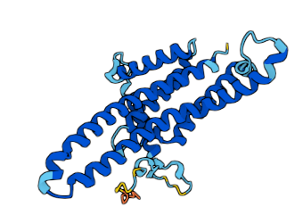 | 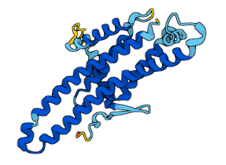 |

Les deux structures AlphaFold montrent une organisation quasi identique :

* Dix hélices transmembranaires alignées en cylindre.
* Les variations se limitent aux boucles périphériques (parties non transmembranaires).
* L’axe central du canal à protons reste parfaitement conservé (pas visible dans l'image).

Cela confirme que, malgré une divergence de séquence, la structure 3D et la fonction de canal sont préservées.

Même si les séquences sont différentes à plus de 50 %, les deux protéines ATP6 remplissent la même fonction et ont une forme très similaire. Cela montre que, malgré l’évolution, la protéine a gardé son rôle essentiel dans la production d’énergie. Les petites différences ne touchent pas les zones importantes, ce qui permet à la protéine de continuer à fonctionner correctement dans les deux espèces.

### Protéine atp8

#### 1. Alignement global

| Critère          | Valeur           | Interprétation                                                             |
| -------------------- | -------------------- | ------------------------------------------------------------------------------ |
| Longueur alignée | 48 aa                | Protéine courte, de même longueur chez les deux espèces                        |
| Identité         | 25 / 48 (52.1 %) | Plus de la moitié des acides aminés sont strictement identiques                |
| Similarité       | 33 / 48 (68.8 %) | Les deux tiers des acides aminés ont des propriétés chimiques similaires       |
| Gaps (indels)    | 0 / 48 (0.0 %)   | Aucun décalage → topologie parfaitement alignée                                |
| Score            | 126.0                | Score alignement significatif pour une petite protéine → conservation probable |

#### 2. Comparaison de la fonction

Fonction déclarée pour les deux espèces (selon UniProt) :
ATP8 est une sous-unité mineure du domaine F₀ de l’ATP synthase. Elle est située dans la membrane mitochondriale, proche de la sous-unité a, et participe au couplage entre le flux de protons et la synthèse d’ATP.

Les deux fiches UniProt donnent une fonction strictement identique.  
Elle joue un rôle complémentaire à d'autres sous-unités dans la structure du complexe.  

#### 3. Comparaison de la structure 3D

| *S. cerevisiae* | *S. pombe* |
| --------------- | ---------- |
| 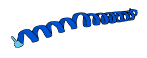 | 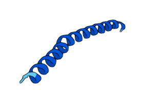 |

Les deux structures AlphaFold montrent :

* Une seule hélice transmembranaire, droite ou légèrement courbée
* Quelques différences dans les extrémités, mais le cœur hélicoïdal est strictement conservé

Les modèles confirment que la forme nécessaire à l’insertion dans la membrane et au contact avec la sous-unité a est maintenue.

Même si ATP8 est une petite protéine, elle est très bien conservée entre les deux espèces. Sa séquence est à moitié identique, sa forme est quasiment la même, et sa fonction est strictement partagée. Cela montre qu’elle joue un rôle important et stable dans la production d’énergie, et que l’évolution n’a pas modifié ses éléments essentiels.

### Protéine atp9

#### 1. Alignement global

| Critère          | Valeur            | Interprétation                                                                  |
| -------------------- | --------------------- | ----------------------------------------------------------------------------------- |
| Longueur alignée | 76 acides aminés (aa) | Longueur totale de l’alignement                                                     |
| Identité         | 45 / 76 (59.2 %)  | Plus de la moitié des acides aminés sont strictement identiques                     |
| Similarité       | 64 / 76 (84.2 %)  | Forte similarité : mêmes propriétés physicochimiques dans la majorité des positions |
| Gaps             | 2 / 76 (2.6 %)        | Très peu d’indels → alignement fiable et structure comparable                       |
| Score            | 253.0                 | Très bon score → ressemblance fonctionnelle et structurale probable                 |

#### 2. Comparaison de la fonction

Fonction décrite pour les deux espèces (UniProt) :
ATP9 correspond à la sous-unité c de l’ATP synthase mitochondriale (complexe V, domaine F₀).
Elle est fortement hydrophobe, et forme un anneau homomérique (c-ring) d’environ 10 sous-unités. Ce c-ring joue un rôle crucial dans le mécanisme rotatif qui transforme le passage des protons (H⁺) en énergie mécanique pour la synthèse d’ATP.

Les deux descriptions sont strictement identiques, confirmant une fonction critique et conservée.

#### 3. Comparaison de la structure 3D

| *S. cerevisiae* | *S. pombe* |
| -------------- | ---------- |
| 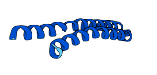 | 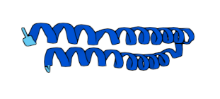 |

Les modèles AlphaFold montrent pour les deux espèces :

* Deux hélices transmembranaires parallèles, typiques de la sous-unité c
* Les deux images sont quasi superposables, malgré quelques variations mineures en surface

La forme canonique de la sous-unité c est clairement conservée, expliquant la forte similarité observée.

ATP9 est une protéine très bien conservée entre S. cerevisiae et S. pombe, aussi bien au niveau de la séquence, de la forme 3D, que de la fonction. Elle joue un rôle clé dans la production d’énergie via l’ATP synthase. Son fort taux de similarité et ses structures presque identiques montrent que cette protéine est essentielle et peu sujette aux changements évolutifs, car elle est indispensable au bon fonctionnement de la respiration cellulaire.

### Protéine cox1

#### 1. Alignement global

| Critère          | Valeur             | Interprétation                                                        |
| -------------------- | ---------------------- | ------------------------------------------------------------------------- |
| Longueur alignée | 543 aa                 | Protéine de grande taille, parfaitement alignée entre les deux espèces    |
| Identité         | 326 / 543 (60.0 %) | 60 % des acides aminés sont strictement identiques                        |
| Similarité       | 415 / 543 (76.4 %) | 76 % ont des propriétés similaires → substitutions souvent conservatrices |
| Gaps             | 14 / 543 (2.6 %)   | Très peu de décalages → structure bien alignée                            |
| Score            | 1814.0                 | Très bon score, typique d’une forte conservation fonctionnelle            |

#### 2. Comparaison de la fonction

Fonction pour les deux espèces (selon UniProt) :
COX1 est une sous-unité catalytique du complexe IV (cytochrome c oxydase), situé à l’extrémité de la chaîne respiratoire mitochondriale. Elle :

* Transfère les électrons depuis le cytochrome c vers l’oxygène moléculaire
* Catalyse la réduction de O₂ en H₂O via un centre binucléaire (héme A3 + cuivre B)
* Contribue à la génération du gradient de protons nécessaire à la synthèse d’ATP

Les fonctions décrites sont strictement identiques entre *S. pombe* et *S. cerevisiae*.   
COX1 est une protéine essentielle à la respiration aérobie. 

#### 3. Comparaison de la structure 3D

| *S. cerevisiae* | *S. pombe* |
| --------------- | ---------- |
| 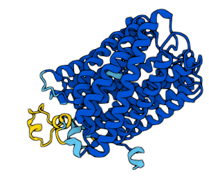 | 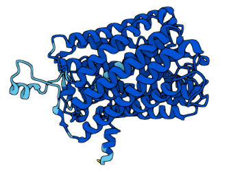 |

Les modèles AlphaFold montrent :

* Une structure dense et complexe faite de nombreuses hélices transmembranaires
* Une forte superposition des deux formes, malgré quelques variations aux extrémités ou en surface
* Le cœur catalytique et le repliement global sont très proches

La forme globale est hautement conservée, garantissant le bon positionnement des groupes héminiques et des atomes de cuivre nécessaires à la catalyse.

COX1 est une protéine très bien conservée entre S. cerevisiae et S. pombe, aussi bien dans sa séquence, sa fonction, que sa structure 3D. Elle joue un rôle central dans la respiration mitochondriale en permettant la transformation de l’oxygène en eau. Les fortes similarités observées montrent que cette protéine est indispensable et a été peu modifiée au cours de l’évolution, car elle est cruciale pour produire l’énergie nécessaire à la cellule.

### Protéine cox2

#### 1. Alignement global

| Critère          | Valeur             | Interprétation                                                              |
| -------------------- | ---------------------- | ------------------------------------------------------------------------------- |
| Longueur alignée | 254 aa                 | Longueur totale des deux séquences après alignement                             |
| Identité         | 129 / 254 (50.8 %) | Un acide aminé sur deux est identique → conservation moyenne mais significative |
| Similarité       | 176 / 254 (69.3 %) | Deux tiers des acides aminés ont des propriétés similaires → fonction conservée |
| Gaps             | 9 / 254 (3.5 %)    | Faible nombre de décalages → structure comparable                               |
| Score Needle     | 713.0                  | Score élevé → alignement fiable et structurellement pertinent                   |

#### 2. Comparaison de la fonction

Fonction décrite pour les deux espèces (UniProt) :
COX2 est une sous-unité catalytique membranaire du complexe IV (cytochrome c oxydase). Elle joue un rôle central dans la respiration mitochondriale :

* Elle reçoit les électrons du cytochrome c via son centre cuivre A (CU(A)).
* Elle les transmet au site actif du COX1 (binuclear center : héme A3 + cuivre B).
* Elle participe ainsi à la réduction de l’oxygène en eau, dernière étape de la chaîne respiratoire.

Les descriptions des deux espèces sont quasiment identiques, confirmant une fonction catalytique critique et hautement conservée.

#### 3. Comparaison de la structure 3D

| *S. cerevisiae* | *S. pombe* |
| --------------- | ---------- |
| 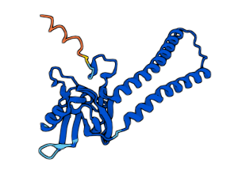 | 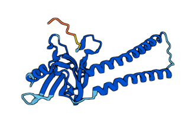 |

Les modèles AlphaFold révèlent :

* Une forme très similaire, avec des hélices transmembranaires stables et un domaine extracellulaire en repliement complexe
* Quelques variations visibles sur les boucles exposées, mais la position du centre cuivre A est vraisemblablement conservée

La structure générale et la topologie sont compatibles avec une fonction catalytique équivalente dans les deux levures.

COX2 est une protéine modérément conservée entre S. cerevisiae et S. pombe, avec une forte similarité dans les zones importantes. Sa fonction clé dans la respiration mitochondriale est préservée, tout comme sa forme générale. Malgré quelques petites différences en surface, le cœur de la protéine, là où se passent les réactions chimiques, reste pratiquement identique. Cela montre que COX2 continue d'assurer le même rôle essentiel dans les deux espèces.

### Protéine cox3

#### 1. Alignement global

| Critère          | Valeur             | Interprétation                                                            |
| -------------------- | ---------------------- | ----------------------------------------------------------------------------- |
| Longueur alignée | 271 aa                 | Taille complète de l’alignement                                               |
| Identité         | 129 / 271 (47.6 %) | Moins de la moitié des acides aminés sont identiques → conservation partielle |
| Similarité       | 177 / 271 (65.3 %) | Forte similarité : acides aminés ayant des propriétés chimiques comparables   |
| Gaps             | 4 / 271 (1.5 %)    | Très peu d’indels → alignement propre                                         |
| Score Needle     | 678.5                  | Bon score → conservation structurale et fonctionnelle probable                |

#### 2. Comparaison de la fonction

Fonction déclarée (UniProt) :
COX3 est une sous-unité membranaire du complexe IV (cytochrome c oxydase). Elle joue un rôle essentiel dans la respiration mitochondriale :

* Elle stabilise l’ensemble du complexe IV
* Elle permet la bonne interaction des sous-unités catalytiques COX1 et COX2
* Elle contribue indirectement à la réduction de l’oxygène en eau et à la création du gradient de protons

La fonction de COX3 est équivalente dans les deux espèces, mais moins directement catalytique que COX1/2.

#### 3. Comparaison de la structure 3D

| *S. cerevisiae* | *S. pombe* |
| --------------- | ---------- |
| 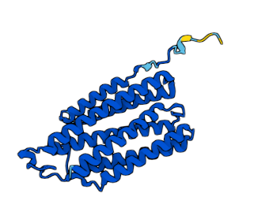 | 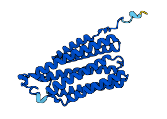 |

Les modèles AlphaFold montrent :

* Deux structures très similaires, avec une organisation en hélices transmembranaires parallèles
* Des différences localisées surtout au niveau des boucles périphériques ou des extrémités
* Le cœur structural est identique, compatible avec une fonction stabilisatrice du complexe IV

La topologie membranaire est conservée, assurant une interaction correcte avec COX1 et COX2

COX3 montre une conservation partielle de la séquence, mais une forme 3D très similaire entre les deux levures. Sa fonction, bien que moins catalytique que COX1 ou COX2, reste essentielle pour stabiliser le complexe respiratoire. Grâce à cette structure bien conservée, COX3 continue de remplir son rôle de support dans la respiration mitochondriale, même si certaines différences existent. Cela confirme une évolution parallèle autour d’une fonction commune.

### Protéine rps3

#### 1. Alignement global

| Critère          | Valeur             | Interprétation                                             |
| -------------------- | ---------------------- | -------------------------------------------------------------- |
| Longueur alignée | 406 aa                 | Taille totale de l’alignement                                  |
| Identité         | 71 / 406 (17.5 %)  | Très faible conservation → nombreuses substitutions            |
| Similarité       | 117 / 406 (28.8 %) | Un tiers seulement des résidus ont des propriétés similaires   |
| Gaps             | 198 / 406 (48.8 %) | Alignement très fragmenté → nombreuses insertions ou délétions |
| Score Needle     | 108.5                  | Score faible → séquences très divergentes                      |

#### 2. Comparaison de la fonction

Fonction principale dans les deux espèces (selon UniProt) :
Rps3 est une protéine ribosomique faisant partie de la petite sous-unité 40S du ribosome. Elle participe à :

* L’initiation de la traduction (liaison aux ARNm et sélection des ARNt)  
* Le maintien de la fidélité de lecture  
* La réparation de l’ADN (activité endonucléase)  
* Certaines fonctions extraribosomiques (apoptose, export ribosomique, stress cellulaire)  

Les descriptions de fonction sont identiques, mais l’étendue fonctionnelle de rps3 dépasse largement le simple rôle structural.

#### 3. Comparaison de la structure 3D

| *S. cerevisiae* | *S. pombe* |
| --------------- | ---------- |
| 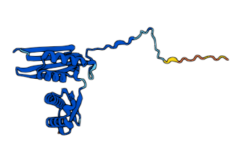 | 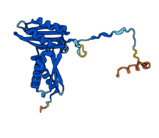 |

Les deux structures présentent un noyau commun (pli β-α-β) typique des protéines ribosomiques.  
La forme globale est relativement conservée, mais les régions périphériques (en jaune/orange) sont très variables.  
Ces segments variables pourraient correspondre à des extensions spécifiques à l’espèce, impliquées dans des rôles extraribosomiques.

La structure centrale ribosomique est préservée, mais les extrémités évoluent rapidement.

Bien que la séquence de Rps3 soit très divergente entre S. cerevisiae et S. pombe, les fonctions ribosomiques de base sont probablement conservées. Les régions divergentes suggèrent des adaptations spécifiques, notamment pour les fonctions extraribosomiques, qui varient selon le contexte cellulaire de chaque espèce.

Rps3 présente une séquence très différente entre S. cerevisiae et S. pombe, avec peu d’acides aminés identiques et beaucoup de gaps dans l’alignement. Pourtant, sa structure 3D montre un noyau commun bien conservé, essentiel au bon fonctionnement du ribosome. Sa fonction principale – fabriquer les protéines dans la cellule – est donc probablement maintenue. Les différences observées concernent surtout des parties externes, liées à des rôles secondaires. Cela suggère que Rps3 a évolué de manière différente selon les espèces, tout en gardant sa fonction de base.

## Sources, références, bibliographie
- Levures et fromage : https://www.actalia.eu/les-levures-dans-les-differents-types-de-fromage/
- Kimchi : https://fr.wikipedia.org/wiki/Kimchi
- Kombucha : https://fr.wikipedia.org/wiki/Kombucha
- aérobie et anaérobie des levures : https://www.svt-a-feuillade.fr/pages/doc_spe_Term/1485796993.
- Utilisation de levure pour synthétiser de la psylocybine : https://www.sciencedirect.com/science/article/pii/S109671761930401X?via%3Dihub
- Métabolisme des levures : https://chem.libretexts.org/Bookshelves/Biological_Chemistry/Fermentation_in_Food_Chemistry_(Graham)/01%3A_Modules/1.10%3A_Yeast_Metabolism#:~:text=The%20metabolic%20pathways%20utilized%20by,phosphate%20pathway%2C%20and%20oxidative%20phosphorylation.
- Glycolyse : https://www.kegg.jp/entry/sce00010
- Glycolyse : https://www.ncbi.nlm.nih.gov/books/NBK482303/
- Cycle de Krebs : https://www.genome.jp/dbget-bin/www_bget?pathway+hsa00020
- atp6, atp8, atp9 : https://journals.plos.org/plosone/article?id=10.1371/journal.pone.0078105
- https://www.uniprot.org/uniprotkb/P05501/entry
- https://pubmed.ncbi.nlm.nih.gov/12187383/
- introns : https://news.ucsc.edu/2022/11/russ-origins-introns/
- COB : https://www.yeastgenome.org/locus/S000007270
- ncRNA : https://en.wikipedia.org/wiki/Non-coding_RNA